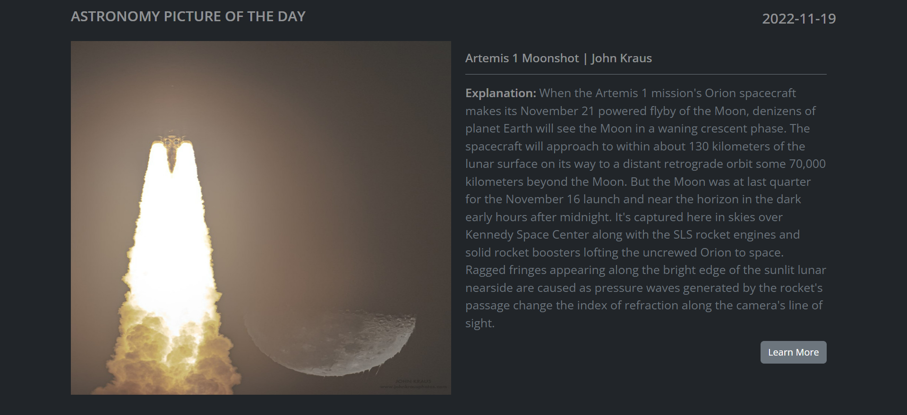

## About
APOD - Astronomy Picture of the Day is a responsive web application fetches data from  [NASA API](https://api.nasa.gov/).

### [See Live](https://strong-pony-a23951.netlify.app//)

## Built With
- React.js
- Bootstrap
- React Bootstrap

## Tools
- React Hooks (useState, useEffect)
- Axios

## Screenshots

